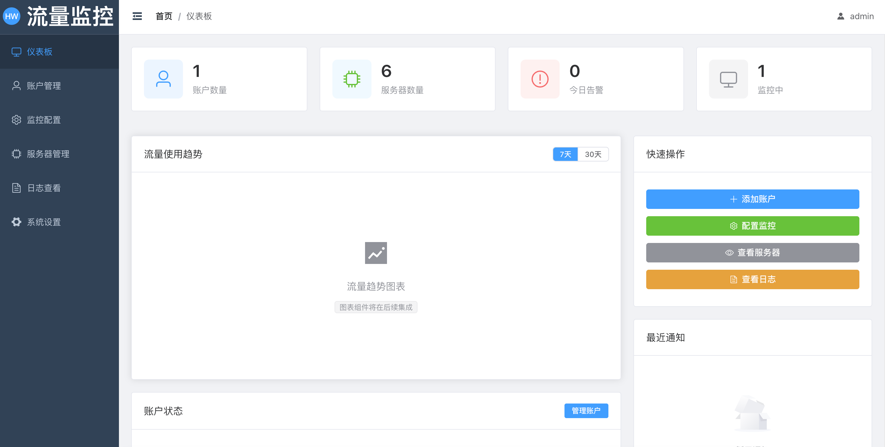
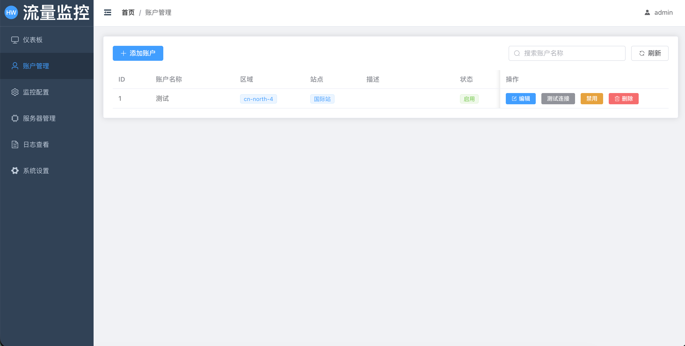
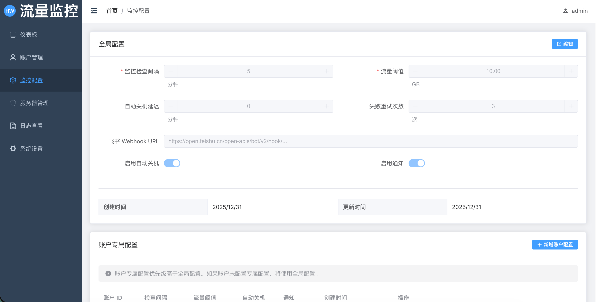

# Huawei Cloud Traffic Monitor（华为云服务器流量监控与自动关机）

[](LICENSE) [](https://hub.docker.com/repository/docker/jiulingyun803/huawei-cloud-traffic-monitor) [](https://github.com/jiulingyun/huawei-cloud-traffic-monitor/actions)

一款面向运维的工具，帮助华为云 ECS 用户实时监控流量包剩余量、在阈值触发时自动关机并通过飞书发送结构化告警卡片。适用于需要集中管理多个账户和大量实例的团队，旨在降低运维成本并避免超额计费。

核心功能
- 实例级流量阈值监控（按实例执行判断）
- 自动关机（可配置延迟与重试）
- 飞书（Feishu）告警卡片（含实例名、公网 IP、剩余流量与阈值）
- 单镜像部署（前端静态文件已打包进后端镜像）
- CI/CD：通过 GitHub Actions 在 push v* 标签时构建并推送镜像到 Docker Hub

## 快速预览

| 页面 | 占位截图 |
|---|---|
| Dashboard 总览 |  |
| 账户与实例管理 |  |
| 告警与通知 |  |

快速开始（推荐：使用 Docker Hub 镜像）
1. 克隆仓库并进入 `docker/`：
```bash
git clone https://github.com/jiulingyun/huawei-cloud-traffic-monitor.git
cd huawei-cloud-traffic-monitor/docker
```
2. 复制环境示例并编辑 `.env`（填写华为云凭证、飞书 webhook、加密密钥等）：
```bash
cp env.example .env
# 编辑 .env
```
3. 拉取并启动服务：
```bash
docker compose -f docker/docker-compose.yml pull
docker compose -f docker/docker-compose.yml up -d
```
4. 打开管理页面： `http://<HOST>:8000`

从源码运行（开发模式）
- 启动后端：
```bash
cd backend
python -m venv venv
source venv/bin/activate
pip install -r requirements.txt
uvicorn app.main:app --reload --host 0.0.0.0 --port 8000
```
- 启动前端（可单独运行）：
```bash
cd frontend
npm install
npm run dev
```

配置要点
- 在系统中添加华为云 AK/SK（系统会加密存储）
- 配置飞书 Webhook 接收告警
- 全局/账户/实例层级配置支持覆盖与继承

发布与镜像（CI/CD）
- Docker Hub 镜像： `jiulingyun803/huawei-cloud-traffic-monitor`  
- 自动构建：在仓库 push `v*` 标签时触发 GitHub Actions，构建并推送 `vX.Y.Z` 与 `latest` 两个标签  
- 设置 Secrets（仓库 Settings → Secrets and variables → Actions）：
  - `DOCKERHUB_USERNAME`
  - `DOCKERHUB_TOKEN`
- 本地自动化发布脚本：`./scripts/release.sh`（会递增 PATCH、更新 `VERSION`、提交并打 tag）

运维命令（常用）
- 查看日志： `docker compose -f docker/docker-compose.yml logs -f huawei-backend`
- 手动初始化数据库（容器内）： `docker compose -f docker/docker-compose.yml exec huawei-backend python /app/init_db.py`
- 重建镜像并启动： `docker compose -f docker/docker-compose.yml up -d --build`

贡献指南
- 欢迎提交 Issue / PR。对于大改动请提供变更说明与测试用例。
- 代码风格：遵循项目现有命名与分层规范，添加单元测试以保障行为。

目录（简要）
```
huawei-cloud-traffic-monitor/
├── backend/    # FastAPI 后端
├── frontend/   # Vue 3 前端（Vite）
├── docker/     # Docker Compose 配置
├── scripts/    # 版本与发布脚本
└── docs/       # 文档与截图
```

许可证
- MIT

联系
- 如需支持或咨询，请在仓库提交 Issue。

本系统旨在帮助华为云用户：
- 实时监控多个账户下的服务器流量使用情况
- 自动关闭流量即将耗尽的服务器，避免超额费用
- 通过飞书及时接收监控告警和关机通知
- 提供友好的 Web 管理界面，便于配置和管理

## 主要功能

- ✅ **多账户管理**：支持添加和管理多个华为云账户
- ✅ **实时监控**：定时监控服务器流量包剩余量
- ✅ **智能告警**：流量低于阈值时触发告警
- ✅ **自动关机**：自动关闭流量不足的服务器
- ✅ **飞书通知**：通过飞书 Webhook 发送实时通知
- ✅ **Web 管理界面**：直观的管理控制台
- ✅ **加密存储**：安全存储账户凭证信息

## 技术栈

### 后端
- Python 3.10+
- FastAPI - 高性能 Web 框架
- SQLite - 轻量级数据库
- APScheduler - 任务调度
- Requests - HTTP 客户端

### 前端
- Vue.js 3 - 渐进式前端框架
- Vite - 现代化构建工具
- Element Plus - UI 组件库
- Axios - HTTP 客户端

## 项目结构

```
huawei-cloud-traffic-monitor/
├── backend/              # 后端服务
│   ├── app/
│   │   ├── api/         # API 路由
│   │   ├── core/        # 核心功能
│   │   ├── models/      # 数据模型
│   │   ├── services/    # 业务逻辑
│   │   └── utils/       # 工具函数
│   ├── tests/           # 测试
│   └── requirements.txt # 依赖列表
├── frontend/            # 前端应用
│   ├── src/
│   │   ├── components/  # 组件
│   │   ├── views/       # 页面
│   │   ├── router/      # 路由
│   │   ├── store/       # 状态管理
│   │   └── api/         # API 调用
│   └── package.json     # 依赖列表
├── docker/              # Docker 配置
├── docs/                # 文档
└── README.md            # 项目说明
```

## 快速开始

### 环境要求

- Python 3.10+
- Node.js 18+
- SQLite 3

### 后端安装

```bash
cd backend
python -m venv venv
source venv/bin/activate  # Windows: venv\Scripts\activate
pip install -r requirements.txt
```

### 前端安装

```bash
cd frontend
npm install
```

### 运行

```bash
# 后端
cd backend
uvicorn app.main:app --reload

# 前端
cd frontend
npm run dev
```

## 配置说明

### 华为云账户配置

1. 在华为云控制台创建 AK/SK
2. 在系统中添加账户信息
3. 系统将自动加密存储凭证

### 飞书 Webhook 配置

1. 在飞书群组中创建自定义机器人
2. 获取 Webhook URL
3. 在系统中配置通知地址

### 监控配置

- 设置流量阈值（GB）
- 配置监控频率（分钟）
- 启用/禁用自动关机

## 部署

### Docker 部署

```bash
docker-compose up -d
```

### 手动部署

详见 [部署文档](docs/deployment.md)

## 开发指南

## 发布与镜像（Docker Hub）

我们在 Docker Hub 上维护镜像 `jiulingyun803/huawei-cloud-traffic-monitor`。你可以直接拉取预构建镜像来运行：

```bash
# 拉取 latest 镜像并运行（在仓库根的 docker/ 目录中有 docker-compose.yml）
docker compose -f docker/docker-compose.yml pull
docker compose -f docker/docker-compose.yml up -d
```

若你本地修改并想自行构建：

```bash
docker compose -f docker/docker-compose.yml build --no-cache
docker compose -f docker/docker-compose.yml up -d
```

GitHub Actions 已配置为在 push `v*` 标签时自动构建并推送两个标签（`vX.Y.Z` 和 `latest`）到 Docker Hub。请在仓库 Settings → Secrets and variables → Actions 中添加：

- `DOCKERHUB_USERNAME`：你的 Docker Hub 用户名（例如 `jiulingyun803`）
- `DOCKERHUB_TOKEN`：Docker Hub 的访问令牌（Personal Access Token）

发布流程简要：

1. 使用 `./scripts/release.sh` 自动递增补丁版本、更新 `VERSION`、提交并推送，然后创建并推送 git tag。  
2. GitHub Actions 检测到 `v*` 标签会构建并推送镜像到 Docker Hub。  
3. 在目标主机上运行 `docker compose -f docker/docker-compose.yml up -d` 即可拉取并启动新镜像。


本项目使用 DevGenius 进行任务管理和开发协作。

### 开发流程

1. 查看当前任务列表
2. 认领任务并更新状态
3. 遵循代码规范进行开发
4. 编写测试并验证功能
5. 提交代码并更新文档

详见 [开发规则](.warp/project-rules.md)

## 贡献

欢迎提交 Issue 和 Pull Request！

## 许可证

MIT License

## 联系方式

如有问题或建议，请提交 Issue。

